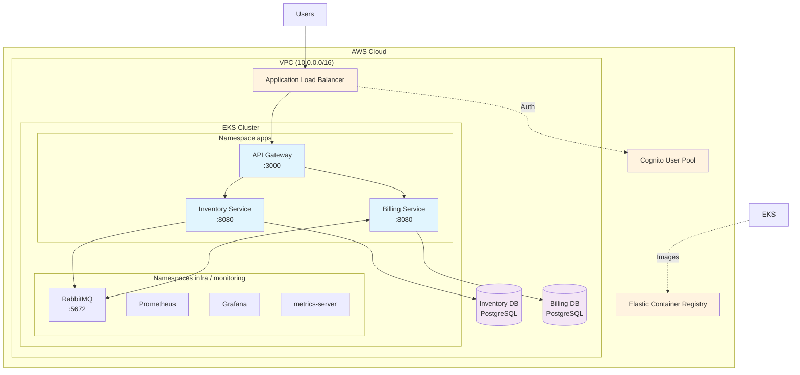

# Cloud Design Platform – Microservices sur AWS EKS

[](https://aws.amazon.com/eks/)
[](https://kubernetes.io/)
[](https://www.terraform.io/)
[](https://nodejs.org/)

Ce guide explique comment déployer notre plateforme microservices sur AWS à l’aide de Terraform, Docker, Kubernetes (EKS) et GitHub Actions. Il sert de runbook technique et consigne les erreurs rencontrées pendant le projet pour éviter de les reproduire.

---

## 🏗️ Vue d’ensemble

### Architecture globale



### Services clés

| Service | Port | Description | Persistance |
|---------|------|-------------|-------------|
| API Gateway | 3000 | Point d’entrée HTTP, auth Cognito & routage | - |
| Inventory Service | 8080 | Gestion des stocks | PostgreSQL (`inventory-db`) |
| Billing Service | 8080 | Facturation & events RabbitMQ | PostgreSQL (`billing-db`) |
| RabbitMQ | 5672 | Message broker | PVC EKS |
| Prometheus / Grafana | - | Observabilité cluster | - |

---

## 🚀 Démarrage rapide

### Prérequis

| Outil | Version mini | Lien |
|-------|--------------|------|
| AWS CLI | ≥ 2.0 | [Installer](https://docs.aws.amazon.com/cli/latest/userguide/getting-started-install.html) |
| Terraform | ≥ 1.6 | [Télécharger](https://www.terraform.io/downloads.html) |
| kubectl | Compatible 1.30 | [Installer](https://kubernetes.io/docs/tasks/tools/) |
| Helm | ≥ 3.0 | [Installer](https://helm.sh/docs/intro/install/) |
| Docker | ≥ 20.0 | [Installer](https://docs.docker.com/get-docker/) |

### Variables d’environnement utiles

```bash
export AWS_PROFILE=tf-dev          # ou cloud-design
export AWS_REGION=eu-west-3
export ACCOUNT_ID=917394547509
export CLUSTER_NAME=pfe-eks
export ECR_REGISTRY=${ACCOUNT_ID}.dkr.ecr.${AWS_REGION}.amazonaws.com
```

---

## 📦 Provisionnement AWS avec Terraform

1. **Initialisation du backend**
   ```bash
   cd infra/terraform
   terraform init -backend-config=backend.hcl
   ```
2. **Planification & apply**
   ```bash
   terraform validate
   terraform plan -out plan.tfplan
   terraform apply plan.tfplan
   ```

**Ressources créées** : VPC (subnets publics/privés + NAT), cluster EKS 1.30, RDS PostgreSQL, SG & IAM (IRSA pour ALB controller).

> 🔎 **Erreur rencontrée** : `ExpiredToken` / `Unable to locate credentials` lors de `terraform apply`. Solution : `aws sso login --profile tf-dev --no-browser` puis exporter les `AWS_ACCESS_KEY_ID/SECRET_ACCESS_KEY/SESSION_TOKEN` avant de relancer.

---

## 🐳 Construction & push des images Docker

```bash
aws ecr get-login-password --region $AWS_REGION | \
  docker login --username AWS --password-stdin $ECR_REGISTRY

for svc in inventory billing api-gateway; do
  pushd services/${svc}-app
  docker build -t ${svc}:latest .
  docker tag ${svc}:latest $ECR_REGISTRY/${svc}:latest
  docker push $ECR_REGISTRY/${svc}:latest
  popd
done
```

> 🔎 **Erreur rencontrée** : `npm ci` échoue sans `package-lock.json`. Deux options : générer le lock (`npm install --package-lock-only`) ou utiliser `npm install --omit=dev` dans le Dockerfile multi-stage.

---

## ☸️ Déploiement Kubernetes

1. **Connexion cluster**
   ```bash
   aws eks update-kubeconfig --region $AWS_REGION --name $CLUSTER_NAME
   ```
2. **Composants d’infrastructure**
   ```bash
   helm repo add bitnami https://charts.bitnami.com/bitnami
   kubectl apply -f k8s/infra/rabbitmq/namespace.yaml
   helm upgrade --install rabbitmq bitnami/rabbitmq \
     --namespace infra \
     -f k8s/infra/rabbitmq/values.yaml

   kubectl apply -f k8s/infra/metrics-server/components.yaml
   kubectl apply -f k8s/infra/aws-load-balancer-controller-sa.yaml
   kubectl apply -f k8s/infra/ingressclass.yaml
   ```
3. **Namespace apps & secretes (via CI)**
   ```bash
   kubectl apply -f k8s/apps/inventory/namespace.yaml
   ```
   Les secrets `inventory-db`, `billing-db`, `api-gateway-auth` sont générés par GitHub Actions (voir section CI). Pour un test manuel, utiliser `kubectl create secret generic ...`.
4. **Déploiement applicatif**
   ```bash
   kubectl apply -f k8s/apps/inventory/
   kubectl apply -f k8s/apps/billing/
   kubectl apply -f k8s/apps/api-gateway/
   ```
5. **Vérification**
   ```bash
   kubectl get pods -n apps
   kubectl get hpa -n apps
   kubectl get ingress -n apps
   ```

> 🔎 **Erreur rencontrée** : ALB non créé → vérifier les logs `kubectl logs -n kube-system deploy/aws-load-balancer-controller` (souvent IRSA ou annotations oubliées).

---

## 🔐 Sécurité & bonnes pratiques

- VPC privé, SG restrictifs (RDS n’autorise que le SG des nœuds EKS).
- NetworkPolicies : seuls les pods du namespace `apps` et l’ALB peuvent communiquer.
- Auth utilisateur via Cognito (User Pool, App Client, domaine).
- IRSA pour ALB controller, service accounts dédiés et conteneurs non root.
- Secrets : plus de YAML versionnés, création dynamique par GitHub Actions.
- TLS : TODO (certificat ACM + domaine custom).

---

## 📊 Observabilité & autoscaling

- **Prometheus / Grafana** dans `monitoring`. Accès :
  ```bash
  kubectl -n monitoring port-forward svc/monitoring-grafana 3000:80
  # Credentials : admin / ChangeMe42!
  ```
- **metrics-server** : manifest custom avec permissions `nodes/proxy` & `nodes/metrics` pour éviter les 403.
- **HPAs** : min 1 / max 5 pods, cible CPU 70 % (`k8s/apps/*/hpa.yaml`).
- **Tests de charge** : job Vegeta pour valider le scaling et alimenter les dashboards Grafana.

> 🔎 **Erreur rencontrée** : `Metrics API not available` → lire les logs `kubectl logs -n kube-system deploy/metrics-server`, ajouter `nodes/proxy` & `nodes/metrics` dans le ClusterRole, redémarrer le pod.

### Exemples de contrôles (outputs réels)

```bash
# Pods applicatifs en cours d'exécution
$ kubectl get pods -n apps
NAME                            READY   STATUS    RESTARTS   AGE
api-gateway-7d78569684-2484l    1/1     Running   0          3h
billing-f48fdb7f5-jflp8         1/1     Running   0          3h
inventory-6955f4cfb5-mc67s      1/1     Running   0          3h

# Ingress ALB provisionné
$ kubectl get ingress -n apps
NAME          CLASS    HOSTS   ADDRESS                                         PORTS   AGE
api-gateway   alb      *       k8s-pfeapps-76786a850e-1198871974.eu-west-3.elb.amazonaws.com   80      3h

# Vérification API → Inventory (curl interne)
$ kubectl -n apps exec deploy/api-gateway -- curl -s -o /dev/null -w "%{http_code}" http://inventory.apps.svc.cluster.local:8080/health
200

# Test connexion PostgreSQL depuis inventory
$ kubectl -n apps exec deploy/inventory -- env PGPASSWORD=$DB_PASS psql \
    -h pfe-inventory-db.c7mg8qiweece.eu-west-3.rds.amazonaws.com \
    -U app_user -d inventory -c 'SELECT now();'
              now
-------------------------------
 2025-09-27 08:12:13.123456+00
(1 row)

# RabbitMQ opérationnel
$ kubectl -n infra exec rabbitmq-0 -- rabbitmq-diagnostics status | head -n 5
Status of node rabbit@rabbitmq-0.rabbitmq.infra.svc.cluster.local ...
- data directory set to /var/lib/rabbitmq/mnesia
- log base directory set to /var/log/rabbitmq
- kernel ready

# HPA alimenté par metrics-server
$ kubectl get hpa -n apps
NAME              REFERENCE                    TARGETS   MINPODS   MAXPODS   REPLICAS   AGE
api-gateway-hpa   Deployment/api-gateway       10%/70%   1         5         1          3h
billing-hpa       Deployment/billing           12%/70%   1         5         1          3h
inventory-hpa     Deployment/inventory         15%/70%   1         5         1          3h

# Grafana port-forward & dashboard
$ kubectl -n monitoring port-forward svc/monitoring-grafana 3000:80
Forwarding from 127.0.0.1:3000 -> 3000
# → Captures d'écran disponibles en annexe
```

---

## 🔄 CI/CD GitHub Actions

### Workflows
- `build.yml` : build & push des images vers ECR (tag `latest` + SHA)
- `deploy.yml` : déploiement EKS (namespace, secrets, manifests, images, rollouts)

### Secrets à fournir (Settings → Secrets & variables → Actions)
```
INVENTORY_DB_HOST / NAME / USER / PASSWORD
BILLING_DB_HOST / NAME / USER / PASSWORD
COGNITO_USER_POOL_ID / APP_CLIENT_ID / USER_POOL_DOMAIN / REGION
AWS_ROLE_TO_ASSUME  # rôle IAM OIDC
```

> 🔎 **Erreur rencontrée** : `Missing required secret: INVENTORY_DB_HOST` → le secret était saisi `NVENTORY_DB_HOST` (I manquant). Toujours relire les noms exacts.

### Déclenchements
- `workflow_dispatch` (lancement manuel depuis l’onglet Actions)
- Activation possible sur push PR selon besoins.

---

## 🛠️ Troubleshooting & incidents notables

| Incident | Symptômes | Résolution |
| --- | --- | --- |
| Tokens SSO expirés | `ExpiredToken`, `Unable to locate credentials` | `aws sso login --profile … --no-browser`, exporter `AWS_*` avant chaque commande sensible.
| metrics-server KO | HPA `unknown`, readiness/liveness 500 | Étendre RBAC (`nodes/proxy`, `nodes/metrics`), redémarrer le pod.
| Secrets manquants | Workflow bloqué `Missing required secret` | Vérifier la casse dans GitHub → Secrets, régénérer les valeurs.
| `npm ci` échoue | `EUSAGE` sans package-lock | Générer `package-lock.json` ou utiliser `npm install --omit=dev`.
| Fichier >100 Mo dans git | Push GitHub refusé (GH001) | `git filter-repo --force --path infra/terraform/minikube-linux-amd64 --invert-paths`, puis push forcé.
| ALB absent | Ingress créé mais pas de Load Balancer | Vérifier logs ALB controller, IAM/IRSA, tags de subnets.

Commandes de debug utiles :
```bash
kubectl describe pod <pod> -n <ns>
kubectl logs <pod> -n <ns>
kubectl top pods -n apps
kubectl get events -n apps --sort-by=.lastTimestamp
kubectl auth can-i --as system:serviceaccount:kube-system:metrics-server get nodes/proxy
```

---

## 📈 Améliorations prévues

- HTTPS via ACM + domaine custom
- Secrets Manager / External Secrets Operator
- Base RDS séparée pour Billing ou schémas dédiés
- Tests end-to-end (k6, Cypress) intégrés à la CI
- GitOps (ArgoCD), environnements multiples (dev/staging/prod)
- Logging centralisé (CloudWatch, Loki)
- Alerting (Prometheus Alertmanager → Slack)

---

## 📚 Annexes

- `docs/` (à compléter) : incident response, capacity planning, backup & restore
- Dashboards Grafana exportés (`docs/dashboards/`)
- Structure du repo :
  ```
  Cloud-Design/
  ├── infra/terraform/
  ├── k8s/
  │   ├── apps/
  │   └── infra/
  ├── services/
  ├── .github/workflows/
  └── README.md
  ```

---

## 🤝 Contribution interne

1. Créer une feature branch, respecter [Conventional Commits](https://www.conventionalcommits.org/)
2. Lancer les tests (`npm test` dans chaque service)
3. Mettre à jour README + dossier projet si nécessaire
4. PR + review avant merge

Support : ouvrir une issue GitHub ou ping sur le canal Slack de l’équipe.

---

<div align="center">

**Made with ❤️ for Cloud Native Applications**

[](https://aws.amazon.com/)
[](https://kubernetes.io/)
[](https://www.terraform.io/)

</div>
